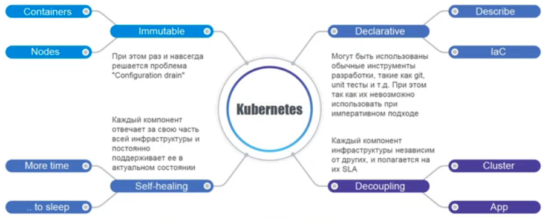

## Введение в Kubernetes, Pod, Replicaset. Вечерняя школа Слёрм по Кубернетес




Link: [YouTube Video](https://www.youtube.com/watch?v=5niyUEvgwyA)
```
kubectl create -f pod.yaml
```

```
kubectl get pod
```

```
kubectl 
```

---
# Kubectl Completition

### Основные сведения
Скрипт дополнения ввода **kubectl** для Bash может быть сгенерирован с помощью команды `kubectl completion bash`. Подключение скрипта дополнения ввода в вашу оболочку включает поддержку автозаполнения ввода для kubectl.

Однако скрипт дополнения ввода зависит от **bash-completion**, поэтому вам нужно сначала установить этот пакет (вы можете выполнить команду `type _init_completion`, чтобы проверить, установлен ли у вас уже bash-completion).

* Установка bash-completion
bash-completion можно установить через многие менеджеры пакеты (см. здесь). Вы можете установить его с помощью `apt-get install bash-completion` или `yum install bash-completion` и т.д.

Приведенные выше команды создадут файл `/usr/share/bash-completion/bash_completion`, который является основным скриптом bash-completion. В зависимости от используемого менеджера пакетов, вы можете подключить этот файл в файле `~/.bashrc`.

Чтобы убедиться, что этот скрипт выполняется, перезагрузите оболочку и выполните команду `type _init_completion`. Если команда отработала успешно, установка сделана правильно, в противном случае добавьте следующее содержимое в файл `~/.bashrc`:

```
source /usr/share/bash-completion/bash_completion
```

Перезагрузите вашу оболочку и убедитесь, что bash-completion правильно установлен, напечатав в терминале `type _init_completion`.

### Включение автодополнения ввода kubectl

Теперь нужно убедиться, что скрипт дополнения ввода kubectl выполняется во всех сессиях командной оболочки. Есть два способа сделать это:

- Добавьте запуск скрипта дополнения ввода в файл `~/.bashrc`:

```
echo 'source <(kubectl completion bash)' >>~/.bashrc
```

- Добавьте скрипт дополнения ввода в директорию `/etc/bash_completion.d`:

```
kubectl completion bash >/etc/bash_completion.d/kubectl
```

- Если у вас определён псевдоним для kubectl, вы можете интегрировать его с автодополнением оболочки:

```
echo 'alias k=kubectl' >>~/.bashrc
echo 'complete -F __start_kubectl k' >>~/.bashrc
```

**Заметка:** Все скрипты дополнения ввода bash-completion находятся в `/etc/bash_completion.d`.
Оба подхода эквивалентны. После перезагрузки вашей оболочки, должны появляться дополнения ввода kubectl.

Источник: https://kubernetes.io/ru/docs/tasks/tools/install-kubectl/
---


```
kubectl get pod
kubectl delete pod --all
```


```
kubectl create -f replicaset.yaml
```

```
kubectl get replicaset

or

kubectl get rs
```


```
kubectl apply -f replicaset.yaml
```

```
kubectl describe rs my-replicaset
```
 