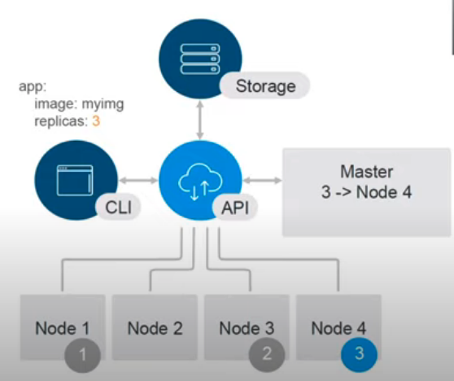

## 05. Deployment, Probes, Resources. Вечерняя школа Слёрм по Кубернетес



Link: [YouTube Video](https://www.youtube.com/watch?v=9qhU_gDMYh4&t=3135s)

File: /deployment.yaml

- Создаем новый deployment

```
kubectl create -f deployment.yaml
kubectl get deploy
kubectl get rs
kubectl get po
```

- Посмотреть поды в интерактивном режиме

```
kubectl get po -w
```

Ключ `-w` показывает интерактивно действия в кубернетес


- Откат до предыдущего состояния ReplicaSet

```
kubectl rollout undo deployment my-deployment
kubectl get po
kubectl get rs
```

Количество по дефолту 10 репликасет хранимых в Kubernetes
Поле для управления копиями RS: Revision History Limit


## Probes

File: /deployment-with-stuff.yaml

- Liveness Probe

```
1. Контроль за состоянием приложения во время его жизни
2. Исполняется постоянно
```

- Readiness Probe

```
1. Проверяет, готово ли приложение принимать трафик
2. В случае неудачного выполнения, приложение убирается из балансировки
3. Исполняется постоянно
```

- Startup Probes

**Homework**
```
1. Проверяет а стартануло ли приложение вообще
```


## Resources

- Limits

```
1. Количество ресурсов, которые POD может использовать
2. Верхняя граница
```

- Requests
Резервировать ресурсы (Кубернетес смотрит на данный порог)
```
1. Количество ресурсов, которые резервируются для PODа на ноде
2. Не делится с другими PODами на ноде
```


CPU : 50m  ( 1 CPU сервера = 1000 милицпу)

Возможные значения для выделения CPU

cpu: 100m < 100 milicpu>

cpu: 1    <1 cpu >


```
kubectl delete deploy my-deployment
kubectl get po -w
<Ctrl + c>

kubectl create -f deployment-with-stuff.yml
kubectl get po -w
kubectl logs ...
kubectl describe node
```

**Homework**
* Kubernetes Quality of Service

Это сервис позволяющий настраивать определить на сколько приложение важно для Kubernetes

Это приоритезация выставленных приложений.


* Pod Priority


----
## Documents Kubernetes
```
kubectl exployment deployment
kubectl exployment deployment.spec
kubectl exployment deployment.spec.strategy

```

---


## Homework

- **Запустить Pod, Replicaset, DEployment**

- Посмотреть что происходит на уровне Docker

- **Добавить в Deployment Startup Probe**

- Узнать как управлять ресурсами Huge Page

- **Почитать про QoS**

- Ознакомиться с документацией