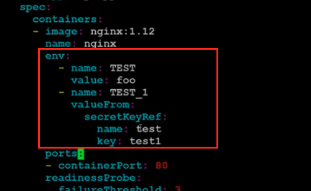

# 06. Service, Ingress, PV, PVC, ConfigMap, Secret. Вечерняя школа Слёрма по Кубернетес

Link: [YuoTube Video](https://www.youtube.com/watch?v=jfqa7lRXDBI)

## ConfigMap


## Secret

Секреты бывают 3-х типов

`generic` - Пароли или токены для приложений или к базам данным. 

`docker-registry` - Данные авторизации в приватный docker-registry

В данноим типе секрета хранится несколько полей доступа, такие как, адрес, логин пароль и e-mail

`tls` - TLS сертификаты для Ingress

Есть два поля, ключ сертификата иполе сертификат.


* Create a secret

Создание простого секрета `generic`

```
kubectl create secret generic test --from-literal=test1=asdf
```
**где:**

Название секрета - test

Название (логин секрета-пароля) --from-literal=***test1***

Сам секрет - ***asdf***

Edit `deployment-with-configmap.yaml` and add some lines



```
kubectl apply -f deployment-with-configmap.yaml
kubectl get secret test -o yaml
```

## Kubectl Cheat sheet 

* **Create**


*Создание объекта из файла*
```
kubectl create -f file.yaml
```

*Создание или обновлние объекта из файла*
```
kubectl apply -f file.yaml
```

*Создание деплоймента из cli*
```
kubectl run --image image_name:tag name [command]
```

* **Interact**

*Выполнение команды внуртри пода*
```
kubectl exec -it pod_name command
```

*Просмотр логов*
```
kubectl logs pod_name
```

* **List**

*Получение списка объектов*
```
kubectl get [pod|replicaset|deployment|...]
```

*Полезные параметры для команды get*

```
-o wide    - Расширенный вывод + IP подов и имена нод
-o yaml    - Получение полного описания объекта в yaml
-n ns_name - Получение объектов в конкретном неймспейсе  
```

*Получение описания объекта и событий по нему*
```
kubectl describe [pod|replicaset|deployment|...]
```

* **Clean up**

*Удаление объекта*
```
kubectl delete [pod|replicaset|deployment|...] object_name
```

*Удаление всех объектов*
```
kubectl delete [pod|replicaset|deployment|...] --all
```

*Удаление всех объектов (не включая ингрессы и конфигмапы)*
```
kubectl delete all --all
```

*Удаление объектов объявленных в файле*
```
kubectl delete -f file.yaml
```

* **Update**

*Изменение объекта на лету*
```
kubectl edit [pod|replicaset|deployment|...] object_name
```

*Обновление имаджа*
```
kubect set image [deployment|...] container=image:tag
```

*Копирование файла из контейнера*
```
kubectl cp ns/pod_name:/etc/config.conf config.conf
```

* **Get Help**

*Получение описания команды, примеров использования и опций*
```
kubectl [command] --help
```

*Получение списка доступных команд*
```
kubectl help
```

*Получение описания объекта определенного типа*
```
kubectl explain [pod|replicaset|deployment| ...]
---
kubectl explain deployment.spec.strategy
```
